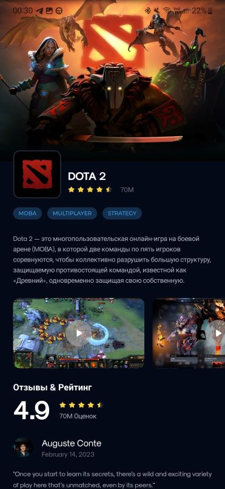

# «Профессиональная разработка мобильных приложений»

## Лабораторная работа №1: реализация экрана при помощи Compose (Android-разработка)

## Задание

Реализуйте представленный ниже экран используя Compose.

- Экран состоит из 5 состояний, начните с первого состояния и дополняйте верстку до финального состояния.
- Данные храните локально, экран должен работать без подключения к интернету.
- Результат работы залейте на созданный вами GitHub репозиторий.
- Заполните Readme в вашем проекте и приложите скриншоты реализованного экрана и apk файл.
- Убедитесь, что ваш проект может быть запущен на другом компьютере.

    
    
    
    
    

## Описание приложения

Глобально, экран состоит из следующих частей:

1. заголовок экрана:
    - логотип игры;
    - название игры;
    - оценка игры (+ количество скачиваний);
2. жанры игры;
3. описание игры;
4. видеоряд геймплея игры;
5. оценка игры от пользователей:
    - заголовок раздела;
    - средняя оценка;
    - рейтинг в звездочках;
    - число оценок;
6. комментарии:
    - имя пользователя;
    - дата комментария;
    - аватар пользователя;
    - комментарий;
7. кнопка скачивания (+ hover-эффект).

## Результат работы

В результате работы был **реализован экран**, состоящий из всех компонентов. Также был **создан репозиторий**, 
в котором хранится история версий экрана (присутствует **ветвление**). Был **оформлен файл README.md**, 
хранящий информацию о лабораторной работе, **создан apk экрана**, **приложены скриншоты работы**. **Настроен .gitignore**, 
чтобы в проекте не было лишних файлов.

## Демонстрация экрана

    
    
    
    

## Ссылка на apk

[Ссылка на скачивание](https://drive.google.com/file/d/1HK3vQfYcBfOrF9RRXmsXhgNWCdD6u_Mj/view?usp=sharing)